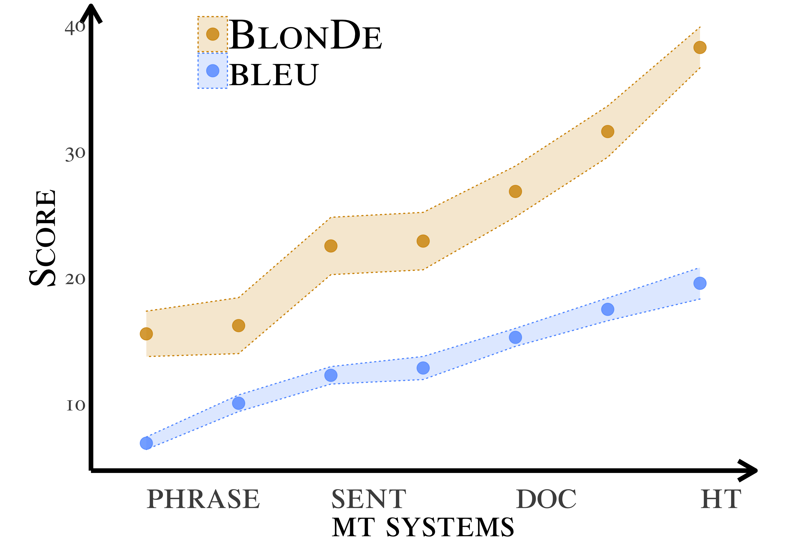
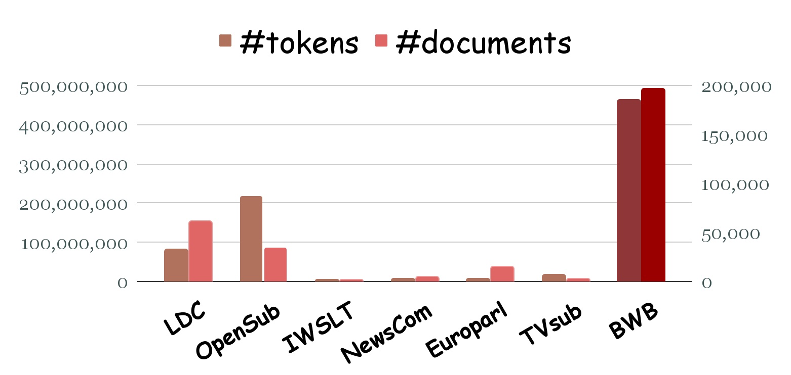

# [BlonDe and BWB](https://arxiv.org/abs/2103.11878)
[](https://img.shields.io/pypi/pyversions/blonde)
[](https://arxiv.org/abs/2103.11878)
[](https://img.shields.io/pypi/v/blonde)
[](https://opensource.org/licenses/MIT) 

BlonDe and BWB are developed for document-level machine translation.
BlonDe is an automatic evaluation metric that explicitly tracks discourse phenomena.
BWB is a large-scale bilingual parallel corpus that consists of web novels.

We hope that they will serve as a guide and inspiration for more work in the area of document level machine translation.


## Quick Links
- 📐 [BlonDe](#the-blonde-package)
    - An Automatic Evaluation Metric for Document-Level Machine Translation.
    - [Package Overview](#package-overview)
    - [Installation](#⏳-installation)
    - [Usage](#usage)


- 📙 [BWB: Bilingual Web Book Dataset](#the-bwb-dataset)
  - A Large-Scale Bilingual Parallel Corpus for Document-Level Machine Translation
  - [Dataset Overview](#dataset-overview)
  - [Annotation Format](#annotation-format)
  - [Download](#download)
  
#### News:
<!-- - Features to appear in the next version (currently in the master branch): -->
- June 2022: Released the BWB dataset.
- May 2022: Released the BlonDe package.
- May 2022: Accepted to NAACL2022 🎉

Please see [release logs](https://github.com/EleanorJiang/CHANGELOG.md) for older updates.

**If you use the BlonDe package or the BWB dataset for your research, please cite:**
```bibtex
@article{jiang-etal-2022-blonde,
      title={{BlonDe}: An Automatic Evaluation Metric for Document-level Machine Translation}, 
      author={Yuchen Eleanor Jiang and Tianyu Liu and Shuming Ma and Dongdong Zhang and Jian Yang and Haoyang Huang and Rico Sennrich and Ryan Cotterell and Mrinmaya Sachan and Ming Zhou},
      year={2022},
      eprint={2103.11878},
      archivePrefix={arXiv},
      primaryClass={cs.CL}
}
```


## The BlonDe package:

### Package Overview



Standard automatic metrics, e.g. BLEU, are not reliable for document-level MT evaluation. They can neither distinguish document-level improvements in translation quality from sentence-level ones, nor identify the discourse phenomena that cause context-agnostic translations.

BlonDe is proposed to widen the scope of automatic MT evaluation from sentence to the document level. It takes discourse coherence into consideration by categorizing discourse-related spans and calculating the similarity-based F1 measure of categorized spans. 

As shown in the figure, BlonDe is a lot more selective than BLEU for document-level MT 
and shows a larger quality difference between human and machine translations.

In the BlonDe package, there are:
- ``BlonDe``: the main metric, combining ``dBlonDe`` with sentence-level measurement
- ``dBlonDe``: measures the discourse phonomena (``entity``, ``tense``, ``pronoun``, ``discourse markers``)
- ``BlonDe+``: takes human annotation (annotated ambiguous/ommitted phrases and manually-annotated NER) into consideration


### ⏳ Installation
**Python>=3.6 only**

Before you install ``blonde``, make sure that
your `pip`, `setuptools`，`wheel` and `spacy` are up to date, and ``en_core_web_sm`` is downloaded.
```sh
pip install -U pip setuptools wheel
pip install -U spacy
python -m spacy download en_core_web_sm
```

Install the official Python module from PyPI:
```sh
pip install blonde
```
Install the latest unstable version from the master branch on Github:
```
pip install git+https://github.com/EleanorJiang/BlonDe
```

Install from the source:
```sh
git clone https://github.com/EleanorJiang/BlonDe
cd BlonDe
pip install .
```
and you may test your installation by:
```
python -m unittest discover
```

### Usage
We provide a command line interface (CLI) of BlonDe as well as a python 
module. 
We provide example inputs under `./example`.

### Command-line Usage
You can use it as follows for the simplest usage:
```sh
blonde -r example/ref.txt -s sys.txt
```

To use human-annotated spans for `BlonDe+`, 
add `-p` and provide the annotation file path with `-an`, as in:
```sh
blonde -r example/ref.txt -s sys.txt -p -an example/an.txt
```

To use human-annotated named entities (instead of automatic detected ones), 
add `-p` and provide the named entity file path with `-ner`, as in:
```sh
blonde -r example/ref.txt -s sys.txt -p -ner example/ner.txt
```
#### The full list of named arguments:
General arguments:
```
  -h, --help            show this help message and exit
  -r REFERENCE [REFERENCE ...], --reference REFERENCE [REFERENCE ...]
                        reference file path(s), each line is a sentence
  -s SYSTEM, --system SYSTEM
                        system file path, each line is a sentence
  --version, -V         show program's version number and exit
```
BlonDe-related arguments:
```
  --categories CATEGORIES [CATEGORIES ...], -c CATEGORIES [CATEGORIES ...]
                        The categories of BLONDE. 
                        Default: ('tense', 'pronoun', 'entity', 'dm', 'n-gram')
  --average-method {geometric,arithmetic}, -aver {geometric,arithmetic}
                        The average method to use, geometric or arithmetic.
                        Defaults: geometric
  --smooth-method {none,floor,add-k,exp}, -sm {none,floor,add-k,exp}
                        Smoothing method: exponential decay, floor (increment zero counts), add-k (increment num/denom by k for n>1), or none.
                        Default: exp
  --smooth-value SMOOTH_VALUE, -sv SMOOTH_VALUE
                        The smoothing value. Only valid for floor and add-k. 
                        Defaults: floor: 0.1, add-k: 1
  --lowercase LOWERCASE, -lc LOWERCASE
                        If True, enables case-insensitivity. Default: True
```
Weight-related arguments:
```
  --override-weights, -w
                        Whether to customize the weights of BLONDE
  --reweight, -rw       Whether to reweight the weights of BLONDE to 1
  --weight-tense WEIGHT_TENSE [WEIGHT_TENSE ...], -wt WEIGHT_TENSE [WEIGHT_TENSE ...]
                        The weights of TENSE (verb types), should be a tuple of length 7, corresponds to ('VBD', 'VBN', 'VBP',
                        'VBZ', 'VBG', 'VB', 'MD'). Defaults: (1/7, 1/7, 1/7, 1/7, 1/7, 1/7, 1/7). Only valid when `override_weights`
                        is used
  --weight-pronoun WEIGHT_PRONOUN [WEIGHT_PRONOUN ...], -wp WEIGHT_PRONOUN [WEIGHT_PRONOUN ...]
                        The weights of PRONOUN, should be a tuple of length 4, corresponds to ('masculine', 'feminine', 'neuter',
                        'epicene'). Defaults: (0.5, 0.5, 0, 0). Only valid when `override_weights` is used
  --weight-entity WEIGHT_ENTITY [WEIGHT_ENTITY ...], -we WEIGHT_ENTITY [WEIGHT_ENTITY ...]
                        The weights of PERSON and NONPERSON entities, Defaults: (1/2, 1/2). Only valid when `override_weights` is
                        used
  --weight-discourse-marker WEIGHT_DISCOURSE_MARKER [WEIGHT_DISCOURSE_MARKER ...], -wdm WEIGHT_DISCOURSE_MARKER [WEIGHT_DISCOURSE_MARKER ...]
                        The weights of DISCOURSE MARKER, should be a tuple of length 5, corresponds to ('comparison', 'cause',
                        'conjunction', 'asynchronous', 'synchronous'). Defaults: (0.5, 0.5, 0, 0). Only valid when
                        `override_weights` is used
```
BlonDe+ related arguments, annotation required:
```
  --plus, -p            Whether to add BLONDE PLUS categories. If so, please provide annotation files that are in the required
                        format.
  --annotation ANNOTATION, -an ANNOTATION
                        Annotation file path, each line is the annotation corresponding a sentence. See README for annotation format
  --ner-refined NER_REFINED, -ner NER_REFINED
                        Named entity file path, each line is the named entities corresponding a sentence. If provided, the annotated
                        named entities instead of the automated recognized ones are used in BLONDE. See README for named entity
                        annotation format
  --plus-categories PLUS_CATEGORIES [PLUS_CATEGORIES ...], -pc PLUS_CATEGORIES [PLUS_CATEGORIES ...]
                        The categories that your annotation files contain, Defaults: ('ambiguity', 'ellipsis'). Only valid when
                        `plus` is used
  --plus-weights PLUS_WEIGHTS [PLUS_WEIGHTS ...], -pw PLUS_WEIGHTS [PLUS_WEIGHTS ...]
                        The corresponding weights of plus categories, should be in the same length as `plus_categories`. Defaults:
                        (1, 1). Only valid when `plus` is used
```


### Using BlonDe from Python
Following [SacreBLEU](https://github.com/mjpost/sacrebleu), we also recommend users to use the object-oriented API, by creating an instance of the `BLONDE` class.
A detailed example is provided in ``example.py``.

#### Loading Package and creating an ``BLONDE`` object:
 ```python
from blonde import BLONDE
blonde = BLONDE()
```
#### For a single document:
 ```python
score = blonde.corpus_score([sys_doc], [[ref_doc_1], [ref_doc_2], ...])
   ```
where  ``sys_doc``, ``ref_doc_1`` and ``ref_doc_2`` are  ``List[str]``.

#### For a corpus:
```python
score = blonde.corpus_score(sys_corpus, [ref_corpus_1, ref_corpus_2, ...])
```
where ``sys_corpus``, ``ref_corpus_1`` and ``ref_corpus_2`` are ``List[List[str]]``.

#### For multiple systems & statistical testing:
 ```python
blonde = BLONDE(references=[ref_corpus]) # for faster recomputation
score = blonde.corpus_score(sys_corpus)
```

#### BlonDe+:
 ```python
blonde_plus = BLONDE(references=[ref_corpus],
                     annotation=an_corpus,
                     ner_refined=ner_corpus
                 )
score = blonde_plus.corpus_score(sys_corpus)
  ```

#### Adjust parameters:
 ```python
BLONDE(weights: Weight=WEIGHTS_DEFAULTS,
       weight_normalize: bool = False,
       average_method: str = 'geometric',
       categories: dict = CATEGORIES,
       plus_categories=None,  # ("ambiguity", "ellipsis")
       plus_weights=(1, 1),
       lowercase: bool = False,
       smooth_method: str = 'exp',
       smooth_value: Optional[float] = None,
       effective_order: bool = False,
       references: Optional[Sequence[Sequence[Sequence[str]]]] = None,
       annotation: Sequence[Sequence[str]] = None,
       ner_refined: Sequence[Sequence[str]] = None)
```
| Parameter | Description !
|-----------|-------------|
| categories | A dict where the keys are chosen from `('tense', 'pronoun', 'entity', 'n-gram')`, and the keys are the names of features in different categories, Dict[str, Sequence[str]]. If `None`, `('tense', 'pronoun', 'entity', 'n-gram')` are included.
| weights | The weights of the aerformentioned features, Dict[str, Sequence[float]]. If `None`, uniform weights are adopted. 
| plus_categories | The human annotated categories, e.g. `('ambiguity', 'ellipsis')` (default: None)
| plus_weights | The weights of the human annotated categories (default: `None`)
| weight_normalize | Whether to reweight to 1 (default: `False`)
| lowercase | If `True`, lowercased BLONDE is computed.
| average_method| The average method to use. Choose from `('geometric', 'arithmetic')`.
| smooth_method| The smoothing method to use. Choose from `('floor', 'add-k', 'exp' or 'none')`.
| smooth_value | The smoothing value for `floor` and `add-k` methods. `None` falls back to default value.
| max_ngram_order| If given, it overrides the maximum n-gram order (default: `4`).
| effective_order| If `True`, stop including n-gram orders for which score is 0. This should be `True`, if sentence-level BLONDE will be computed.
| references| A sequence of reference documents with document being defined as a sequence of reference strings. If given, the reference n-grams and lengths will be pre-computed and cached for faster BLONDE computation across many systems.

[comment]: <> (#### Cohesion Score &#40;beta&#41;:)

[comment]: <> ( ```)

[comment]: <> (    cohesion_score = cohesion&#40;sys_doc,word_frequency_file, weight_for_oov=300000, exclu_stop=True, norm=True&#41;)

[comment]: <> ( ```)

[comment]: <> (- ``word_frequency_file``: a ``json`` file containing word frequency table.)

[comment]: <> (- ``weight_for_oov``: the unormalized weight for out of vocabulary.)

[comment]: <> (- ``exclu_stop``: ``True`` when the stop words is excluded.)

[comment]: <> (- ``norm``: ``True`` when normalization is conducted.)


[comment]: <> (- ``nltk.stopwords``, ``nltk.wordnet``: for cohesion score &#40;beta&#41;)

[comment]: <> (  ```)

[comment]: <> (    pip install nltk)

[comment]: <> (  ```)

[comment]: <> (  then run the Python interpreter:)

[comment]: <> (  ```)

[comment]: <> (    import nltk)

[comment]: <> (    nltk.download&#40;&#41;)

[comment]: <> (  ```)

[comment]: <> (  In the NLTK Downloader window, choose ``wordnet``.)

## The BWB dataset:

### Dataset Overview

The BWB dataset is a large-scale document-level Chinese--English parallel dataset.
It consists of Chinese online novels across multiple genres (sci-fi, romance, action, fantasy, comedy, etc.) 
and their corresponding English translations crawled from the Internet.
The novels are translated by professional native English speakers, and are corrected by editors.

To the best of our knowledge, this is the largest document-level translation dataset to date. 

#### The Statistics of BWB:

|      |   Train   |  Test  |  Dev  |  Total  |
|-----------|-------------|-----------|-----------|-----------|
| #Docs     | 196,304        | 80      | 79      | 196K   |
| #Sents       | 9,576,566    | 2,632     | 2,618      | 9.58M     |
| #Words      | 325.4M        | 68.0K      | 67.4K     | 460.8M      |


[comment]: <> (### Comparison with other datasets)

[comment]: <> (|   Dataset   |   Domain   | Language |  #Docs  |  #Sents  )

[comment]: <> (|-----------|-------------|-----------|-----------|-----------|)

[comment]: <> (| BWB     | Novels        | ZH-EN      | 196.3K      | 9.58M  |)

[comment]: <> (| WMT News    | News    | DE-EN     | 68.4k      | 3.63M     |)

[comment]: <> (| [OpenSubtitles]&#40;https://opus.nlpl.eu/OpenSubtitles-v2018.php&#41;      | Subtitles        | 29.1k     | 67.4K     | 460.8M      |)

**Note:**

- Each **document** is a chapter. 
- The source document and the target document are aligned at the **sentence**-level.
- To prevent any train-test leakage, we split the dataset into a training, development and a test set such that chapters from the same book are part of the same split. 


### Annotation Format
The test set of BWB is annotated.
For each document, there are:
- ``chs_re.txt``: the original Chinese document. Each line is a sentence.
- ``ref_re.txt``: the reference English document. Each line is a sentence.
- ``ner_re.txt``: the named entities that appear in each sentence and their counts in the sentence.
- ``an.txt``: the error type, along with the spans that may cause ``ambiguity`` or ``ellipsis``.

**Error Types:**

|  Error Type    |   #id   |  Description  |  With Span Annotation  |  
|-----------|-------------|-----------|-----------|
| ``ambiguity``     | 1       | There is(are) some ambiguous term(s) that is(are) correct in the stand-alone sentence but wrong in context.       |:heavy_check_mark:      |
| ``ellipsis-pronoun``     | 2    | There is(are) error(s) caused by the omission of pronouns.     | :heavy_check_mark:       | 
| ``ellipsis-other``     | 3       | There is(are) error(s) caused by the omission of other phrases.      | :heavy_check_mark:     | 
| ``named entity``      | 4       | There is(are) error(s) due to the mistranslation of named entities.    |    | 
| ``tense``      | 5       | There is(are) error(s) due to tense.     |    | 
| ``sentence-level``| 6 | There is(are) sentence-level error(s). |    | 


For better reproducing our results, we also provide:
- ``mt_re.txt``: the MT output we use in discourse error analysis. Each line is a sentence.
- ``pe_re.txt``: the human post-editing on provided the MT output by professional translators. 

### Example
``chs_re.txt``:
```
乔恋攥紧了拳头，垂下了头。
其实他说得对。
自己就是一个蠢货，竟然会相信了网络上的爱情。
她勾起了嘴唇，深呼吸一下，正打算将手机放下，微信上却被炸开了锅。
她点进去，发现是凉粉群，所有人都在@她。
【乔恋：怎么了？
【川流不息：乔恋，快看微博头条！ 微博头条？
她微微一愣，拿起手机，登陆微博，在看到头条的时候，整个人一下子愣住了！
剧组发布会。 沈凉川应邀出场，导演立马恭敬地迎接过来，客气的跟他说这话，表达着自己对他能够到来的谢意。
沈凉川没有说话，看向不远处的王文豪。
王文豪出事以后，所有的作品全部下架，而这一部剧还能播出，是因为王文豪在里面友情饰演的男三号戏份很少，几乎可以忽略不计。
剧组根本就没有邀请王文豪，可他却不知道从哪里拿到了邀请函，自己堂而皇之的进来了。 他当然要进来了。
这是他最后的机会了。
丑闻闹出来，几乎所有的广告商和剧组都跟他毁约。
他现在宁可拍男三号，也不想就此沉寂。
因为他的事情，根本就压不下去。
所以王文豪在发布会上，到处讨好别人。
沈凉川穿着一身深灰色西装，面色清冷，手里端着一个高脚香槟杯，站在桌子旁边，整个人显得格外俊逸，却也格外的清冷，让周围的人都不敢上前搭讪。 他一个人，就是一个世界。
可如果能注意到他，就会发现他的视线，却总是若有似无的飘到王文豪身上。
宋城站在他的身边，察觉到这一点以后，就忍不住拽了拽他的胳膊。
沈凉川淡淡回头，看向他，目露询问。
“沈哥，您到底是要干什么啊？ 能不能告诉我，好让我有个心理准备。 您这样突然跑过来参加这么一个小剧组的发布会，又什么都不说就这么杵着，我心里瘆的慌。”
沈凉川听到这话，抿了一口香槟，接着，将香槟杯放下。
旋即，他迈开了修长的步伐。
宋城的心都提了起来，紧跟在他身后。 沈凉川一步一步往前，走到了前方。
王文豪正在跟别的三流小明星套近乎，那个人询问，“听说你打了一个狗仔？”
“对啊，现在的狗仔就是惹人厌恶，我早就想动手教训他们了！ “你这样，就不怕跟他们结仇啊？”
“我都这样了，我怕什么？ 当初沈影帝以正当防卫为借口，将一名狗仔打了，告到了法庭上去不也不了了之吗？
王文豪说到这里，嘿嘿一笑。 还想说什么，忽然察觉到身后有人靠近。
他回头，就看到沈凉川，眼瞳一缩，舔着脸笑，却见沈凉川往前一步，一把揪住他的衣领，接着一拳头对着他的脸就砸过来！
```

``ref_re.txt``:
```
Qiao Lian clenched her fists and lowered her head.
Actually, he was right.
She was indeed an idiot, as only an idiot would believe that they could find true love online.
She curled her lips and took a deep breath. Just when she was about to put down her cell phone, a barrage of posts bombarded her WeChat account.
She logged into her account and saw that a large number of fans in the Shen Liangchuan fan group had tagged her.
[Qiao Lian: What happened?]
[Chuan Forever: Qiao Lian, look at the headlines on Weibo, quickly!]
She froze momentarily, then picked up her cell phone and logged into Weibo. When she saw the headlines, her entire body immediately froze over again!
Shen Liangchuan arrived at the scene after accepting the invitation. The director immediately went to greet him in a respectful manner, politely welcoming him and expressing his gratitude for Shen Liangchuan’s presence today.
Shen Liangchuan did not speak. Instead he looked at Wang Wenhao, who was nearby.
After Wang Wenhao’s scandal broke, every film he starred in had been taken down. Only this show could still be broadcasted, as Wang Wenhao had a supporting role in it and was practically unnoticeable.
In fact, the cast and crew hadn’t even invited Wang Wenhao. However, he had obtained a copy of the invitation letter somehow, and strode imposingly into the venue anyway.
After all, this was his final chance.
After his scandals broke, practically every advertiser and filming crew wanted to break their contracts with him.
He would rather take a supporting role than fade out into obscurity.
That was because the scandals surrounding him would never disappear.
Thus, Wang Wenhao went around trying to curry favor with everybody at this press conference.
Shen Liangchuan was wearing a dark grey suit and he had a cold expression. He was holding a champagne glass and was currently standing beside a table. He looked exceptionally stylish, but also exceptionally icy. As a result, none of the people around him dared to approach him.
If anyone had paid attention to him, they would have noticed that his gaze kept drifting over to Wang Wenhao.
Song Cheng stood at his side. After noticing his behavior, he could not help but pinch his arm.
Shen Liangchuan turned around and looked at him casually, with a questioning face.
“Brother Shen, what are you planning to do? Can you tell me beforehand so that I can prepare myself mentally. You suddenly decide to come and attend such a small-scale press conference, yet you have been completely silent and are now just standing here and doing nothing? My heart is beating anxiously right now.”
After Shen Liangchuan heard him speak, he sipped a mouthful of champagne and put the glass down.
Then, he walked away in long strides.
Song Cheng was extremely nervous and followed him. Shen Liangchuan walked forward, one step at a time, until he reached the front of the room.
Wang Wenhao was currently ingratiating himself with a C-list celebrity. The celebrity asked, “Hey, I heard that you beat a paparazzi?”
“Yeah, the paparazzi nowadays are so disgusting. I have wanted to teach them a lesson myself for some time now!” "Are not you afraid of becoming an enemy of them?"
“I’ve already done it, so what should I be scared of? That time Best Actor Shen beat up a reporter, he claimed that it was in self-defence so that he would have an excuse if he got sued, right? At that time, nobody said anything” 
As Wang Wenhao spoke, he laughed heartily. Just as he was about to continue speaking, he suddenly felt a presence approaching him from behind.
He turned around and saw Shen Liangchuan. His eyes narrowed and attempted to smile at him. However, Shen Liangchuan took a step forward, grabbed his tie and threw a punch at his face!
```

``ner_re.txt``:
```
PERSON: (Qiao Lian: 1; )	NONPERSON: ()
PERSON: ()	NONPERSON: ()
PERSON: ()	NONPERSON: ()
PERSON: ()	NONPERSON: (WeChat: 1; )
PERSON: (Shen Liangchuan: 1; )	NONPERSON: ()
PERSON: (Qiao Lian: 1; )	NONPERSON: ()
PERSON: (Qiao Lian: 1; )	NONPERSON: (Weibo: 1; )
PERSON: ()	NONPERSON: (Weibo: 1; )
PERSON: (Shen Liangchuan: 1; )	NONPERSON: (Shen Liangchuan’s: 1; )
PERSON: (Shen Liangchuan: 1; Wang Wenhao: 1; )	NONPERSON: ()
PERSON: (Wang Wenhao: 1; )	NONPERSON: (Wang Wenhao’s: 1; )
PERSON: (Wang Wenhao: 1; )	NONPERSON: ()
PERSON: ()	NONPERSON: ()
PERSON: ()	NONPERSON: ()
PERSON: ()	NONPERSON: ()
PERSON: ()	NONPERSON: ()
PERSON: (Wang Wenhao: 1; )	NONPERSON: ()
PERSON: (Shen Liangchuan: 1; )	NONPERSON: ()
PERSON: (Wang Wenhao: 1; )	NONPERSON: ()
PERSON: (Song Cheng: 1; )	NONPERSON: ()
PERSON: (Shen Liangchuan: 1; )	NONPERSON: ()
PERSON: ()	NONPERSON: ()
PERSON: (Shen Liangchuan: 1; )	NONPERSON: ()
PERSON: ()	NONPERSON: ()
PERSON: (Song Cheng: 1; Shen Liangchuan: 1; )	NONPERSON: ()
PERSON: (Wang Wenhao: 1; )	NONPERSON: ()
PERSON: ()	NONPERSON: ()
PERSON: ()	NONPERSON: ()
PERSON: (Wang Wenhao: 1; )	NONPERSON: ()
PERSON: (Shen Liangchuan: 2; )	NONPERSON: ()
```

``an.txt``:
```
Joe clenched his fist and bowed his head.	4,Joe <pos/1,3>	3,her, his <pos/35,37>
In fact, he's right.	2	5
I am a fool, even will believe the love on the Internet.	2	5
She ticked her lips, took a deep breath, and was about to put her phone down, but weChat was blown open.	6	1,bombarded, blown open <pos/94,103>
She nodded in and found it was a cold powder group, and everyone was on her.	1,logged, nodded <pos/5,10>	4,cold powder group <pos/34,50>
Joe: What's the matter?	4,Joe <pos/1,3>
Chuan-flowing: Joe love, quickly look at the micro-blogging headlines! Weibo headlines?	4,Chuan-flowing <pos/1,13>;Joe love <pos/18,25>;micro-blogging <pos/50,63>
She took a slight look, picked up the phone, landed on the micro-blog, when she saw the headlines, the whole person suddenly choked!	1,logged, landed on <pos/46,54>	6
The show's release. Shen Liangchuan was invited to appear, the director immediately greeted him with respect, politely said this to him, expressed his gratitude for his arrival.	0
Shen Liangchuan did not speak, look not far from Wang Wenhao.	6
After Wang Wenhao's accident, all the works were off the shelves, and this play can also be broadcast, because Wang Wenhao in the friendship played by the male no. 3 play is very few, almost negligible.	1,taken, off the shelves <pos/50,64>	5	6
The crew did not invite Wang Wenhao, but he did not know where to get the invitation, his own entrance. Of course he's coming in.	5
This is his last chance.	5
The scandal broke, and almost all advertisers and crews broke his contract with him.	2	6
He would rather shoot the men's number three now than be silent about it.	1,fade, be silent about <pos/55,69>	6
Because of his affairs, there is no pressure.	5	6
So Wang Wenhao at the press conference, everywhere to please others.	6
Shen Liangchuan wearing a dark gray suit, cold-faced, hand with a high-footed champagne glass, standing next to the table, the whole person appears extra or less handsome, but also extraordinarily cold, so that people around are afraid to come forward. He is a man, is a world.	1,very, extra or less <pos/149,161>;icy, cold <pos/200,203>	5
But if you can notice him, you will find his sight, but always if there is nothing floating to Wang Wenhao body.	6	5	7
Songcheng stood by his side, aware of this, can not help but pull his arm.	5
Shen Liangchuan faint lying back, looked at him, blind inquiry.	6	7
"Shen brother, what the hell are you doing? Can you tell me so that I have a mental preparation. You suddenly ran over to attend the launch of such a small group, and said nothing so, I panicked. "	1,press, launch <pos/135,140>
Shen Said, took a sip of champagne, and then put the champagne glass down.	6
Immediately, he took a slender step.	1,long stride,slender step <pos/24,35>
Songcheng's heart was raised and followed immediately behind him. Shen Liangchuan step by step forward, walked forward.	1,nervous, raised <pos/23,28>	6
Wang Wenhao is with other third-rate star-studded sets, the man asked, "I heard you hit a paparazzi?" "	6	5
"Yeah, the paparazzi are disgusting now, I've wanted to teach them! "You're not afraid to feud with them, " he said. 	0
"I'm all there, what am I afraid of? At the beginning Shen Shadow Emperor to self-defense as an excuse, a paparazzi hit, to the court to go to the court is not it"?	4,Shen Shadow Emperor <pos/56,74>	5	7
Wang Wenhao said here, hey hey smile. Want to say something, suddenly realized that someone behind him is close.	3,He, Want to <pos/39,45>	6	1,approaching, close <pos/109,113>	5	7
He looked back, he saw Shen Liangchuan, eyes shrink, licking his face and smiling, but saw Shen Liangchuan a step forward, a holding his collar, and then a fist to his face hit!	3,his, eyes <pos/41,44>	6	7
```
### Download
Download the BWB dataset from [this Google Drive link](https://drive.google.com/drive/folders/12K1-DWmpEdqkaR_61aogdywsALDg4z1L?usp=sharing).
